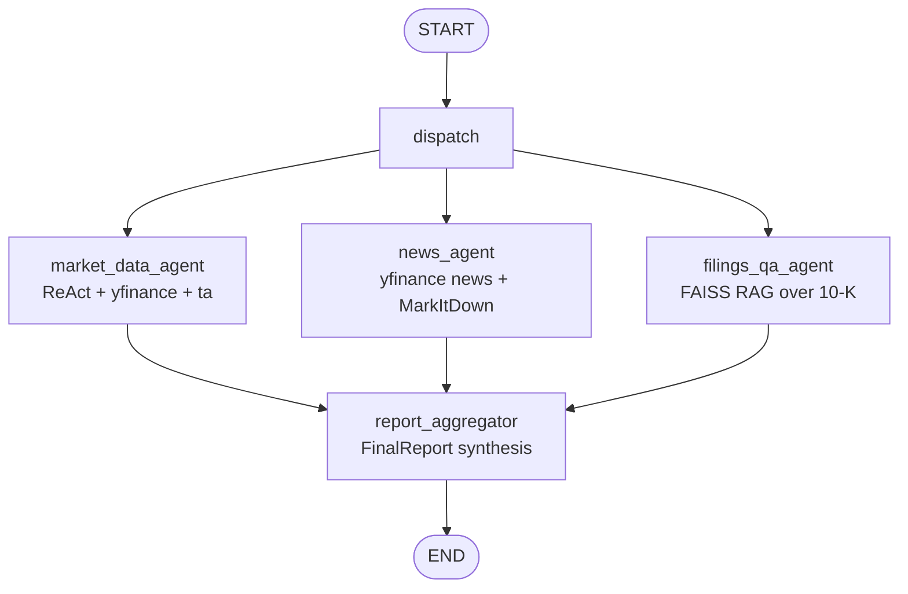

# Finance Agent

A multi-agent equity-research workflow built on **LangGraph 1.2+**, **LangChain 1.3+**, and **Google Gemini**.

Given a stock ticker and a question, the agent runs three specialists **in parallel** — market data + technicals, news sentiment, and a RAG pass over SEC filings — and synthesizes their outputs into a single, structured `FinalReport` (BUY / HOLD / SELL with confidence, rationale, key risks, and citations).

> Originally bootstrapped from four tutorial notebooks (preserved under [`examples/`](./examples/)) and rebuilt from scratch as a typed, tested, installable Python package.

---

## Architecture



- **`market_data_agent`** — `langchain.agents.create_agent` with two tools (`get_stock_prices`, `get_financial_metrics`) and structured output (`MarketDataAnalysis`).
- **`news_agent`** — yfinance news → MarkItDown article extraction → Gemini with structured output (`NewsAnalysis`).
- **`filings_qa_agent`** — FAISS vector store over a local 10-K text → Gemini structured output (`FilingsAnswer` with citations).
- **`report_aggregator`** — Gemini structured output (`FinalReport`) combining the three sub-results.

The three specialists are sibling nodes branching from a common `dispatch` hub — LangGraph automatically runs them concurrently and joins their outputs at the aggregator.

---

## Installation

Requires **Python 3.11+**.

```bash
git clone https://github.com/iam-armoin/finance-agent.git
cd finance-agent

python -m venv .venv
# Windows
.venv\Scripts\activate
# macOS / Linux
source .venv/bin/activate

pip install -e ".[dev]"
```

## Configuration

```bash
cp .env.example .env
# then open .env and fill in GOOGLE_API_KEY
```

All model names live in `.env` — they are **never** hardcoded in the source.

| Variable | Purpose | Example |
| -------- | ------- | ------- |
| `GOOGLE_API_KEY` | Google AI Studio API key | `AIzaSy…` |
| `GEMINI_MODEL` | Chat model | `gemini-2.5-flash` |
| `GEMINI_EMBEDDING_MODEL` | Embedding model for RAG | `models/text-embedding-004` |
| `FILINGS_TEXT_PATH` | Source filing for RAG | `data/Nvidia_10K_20240128.txt` |
| `FAISS_INDEX_PATH` | Where the FAISS index lives | `.faiss_index/nvda_10k` |
| `CHUNK_SIZE` / `CHUNK_OVERLAP` | RAG chunking parameters | `1200` / `150` |
| `RETRIEVAL_K` | Top-k retrieved chunks | `6` |
| `NEWS_MAX_ARTICLES` | Cap on news articles fetched | `8` |
| `NEWS_REQUEST_TIMEOUT` | HTTP timeout for article extraction | `20` |
| `LOG_LEVEL` | Logging level | `INFO` |

---

## Usage

### 1. Build the RAG index (once)

```bash
finance-agent build-index
```

This chunks `data/Nvidia_10K_20240128.txt`, embeds it with Gemini, and persists a FAISS store under `.faiss_index/nvda_10k/`. Subsequent runs load this cache instantly. The shipped 10-K is NVIDIA's FY2024 filing.

You can override the source filing:

```bash
finance-agent build-index --filings-path data/another_10k.txt
```

### 2. Run the agent

```bash
finance-agent run \
  --ticker NVDA \
  --question "Given the FY24 10-K, recent news, and market signals, is NVDA a buy?"
```

A pretty-printed `FinalReport` is rendered with `rich`:

```
╭──────────────── Final Report ─────────────────╮
│  Ticker          NVDA                         │
│  Recommendation  BUY                          │
│  Confidence      MEDIUM                       │
╰───────────────────────────────────────────────╯
```

### 3. Resume a session (conversation memory)

LangGraph's checkpointer keeps state per `thread-id`:

```bash
finance-agent run -t NVDA -q "What were the key risks?"         --thread-id session-1
finance-agent run -t NVDA -q "Anything you would change?"        --thread-id session-1
```

### 4. Stream intermediate updates

```bash
finance-agent run -t NVDA -q "..." --verbose
```

### Programmatic use

```python
from finance_agent import build_graph

graph = build_graph()
result = graph.invoke(
    {"ticker": "NVDA", "question": "Is NVDA a buy?"},
    config={"configurable": {"thread_id": "demo"}},
)
print(result["final_report"].model_dump_json(indent=2))
```

---

## Project layout

```
src/finance_agent/
├── config.py              # pydantic-settings (env-driven, frozen)
├── llm.py                 # Gemini chat + embeddings factories
├── state.py               # AgentState (Pydantic) with reducers
├── schemas.py             # All structured-output schemas
├── prompts.py             # Centralized system prompts
├── graph.py               # build_graph()
├── cli.py                 # Typer CLI
├── tools/
│   ├── market_data.py     # @tool yfinance + ta indicators
│   ├── news.py            # yfinance news + MarkItDown extraction
│   └── filings.py         # FilingsRetriever (FAISS)
└── agents/
    ├── market_data_agent.py
    ├── news_agent.py
    ├── filings_agent.py
    └── report_agent.py
```

---

## Development

```bash
# lint
ruff check src tests

# type-check
mypy src

# test (no network required)
pytest -q
```

Tests use stubbed `yfinance`, deterministic fake embeddings, and `FakeListChatModel` — they never touch the Gemini API or the public internet.

To run an optional integration suite that does call real APIs, set `GOOGLE_API_KEY` and run:

```bash
pytest -m integration
```

---

## Cost & rate limits

- The Gemini Free tier comfortably handles a few hundred runs per day. Embedding the bundled 10-K (~345 KB → a few hundred chunks) is well within free-tier limits.
- The CLI defaults `temperature=0` everywhere and reuses cached LLM clients (`@lru_cache`) — each end-to-end run is ~4 chat calls + 1 ReAct loop's worth of tool calls.

---

## Acknowledgements

The original tutorial notebooks under [`examples/`](./examples/) were the starting point. The implementation under `src/` is a clean rewrite — different topology, different LLM provider, full typing, tests, and structured outputs.
